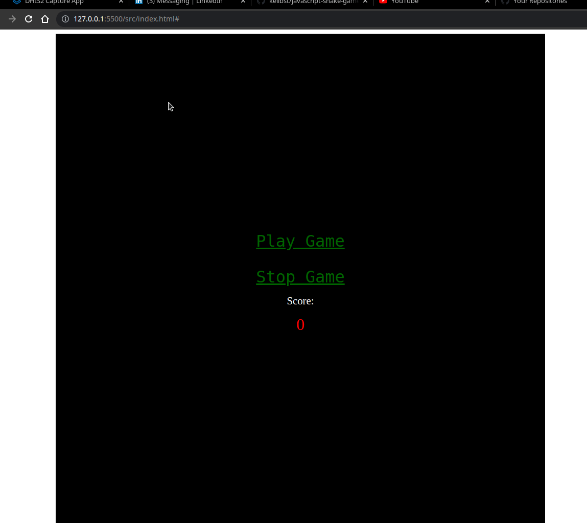

# javascript-snake-game

A basic snake Game using JavaScript

## Built With

- HTML
- CSS
- Javascript

## Getting Started

To get a local copy up and running follow these simple example steps.

### Setup

1.  Open a terminal, navigate to the directory that you would like to clone the repository into using commands like:

    - `cd /pathname` to change your working directory.

2.  Next, clone the remote repository and create a local copy on your machine using this command:

    - `git clone https://github.com/kelibst/javascript-snake-game.git`

3.  Now you can see the contents of the remote repository on your machine by moving into the newly cloned directory:

    - `javascript-snake-game`
    - `ls -la`

### Run

Open the index.html file in the a browser

## Author

👤 **Keli Booster**

- GitHub: [@kelibst](https://github.com/kelibst)
- Twitter: [@keli_booster](https://twitter.com/fizzo_geek)

## Show your support

Give a ⭐️ if you like this project!
